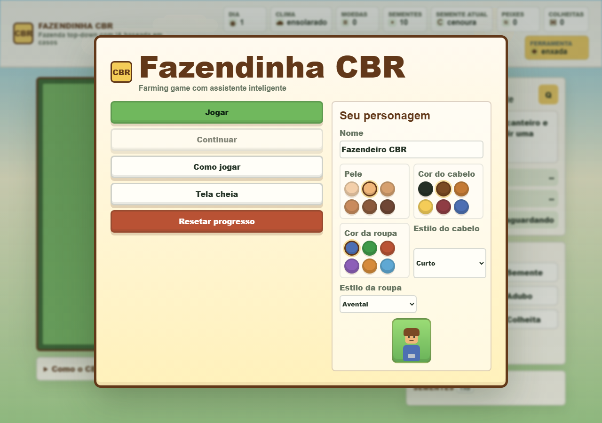
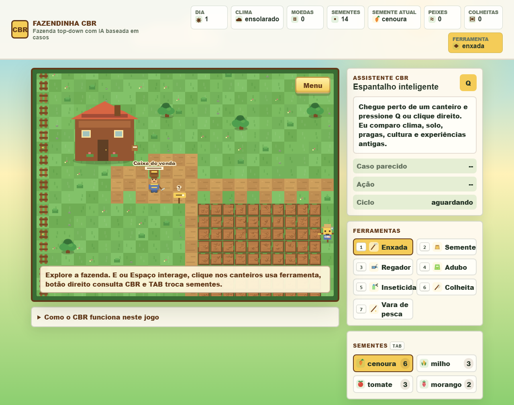
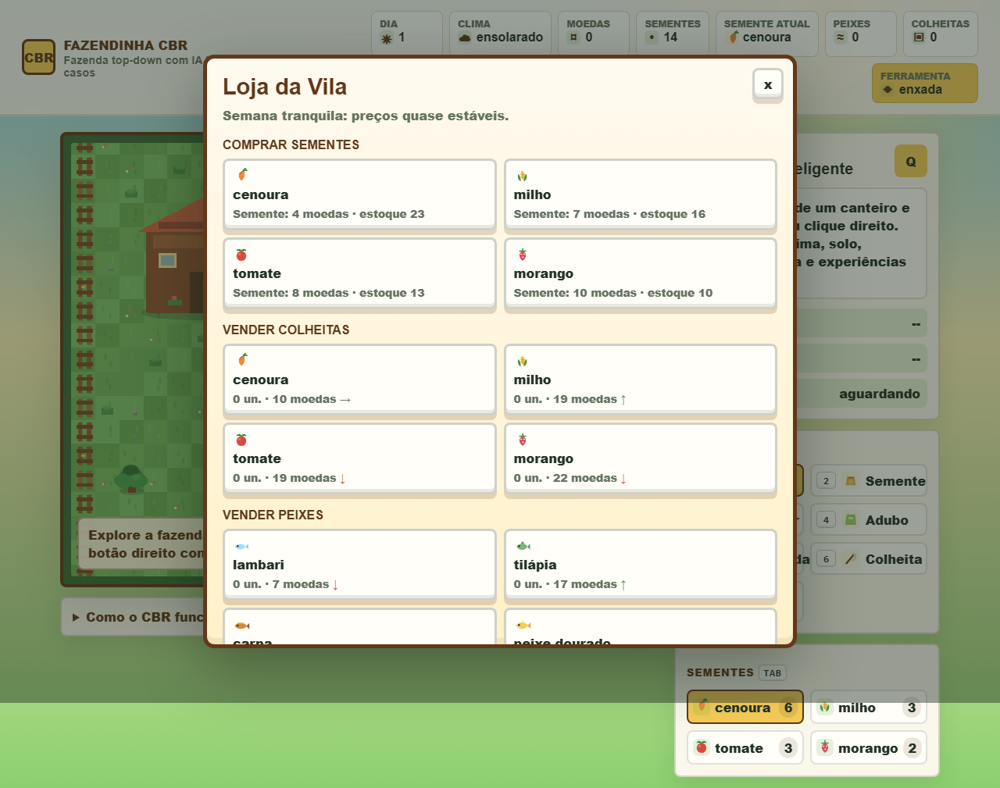
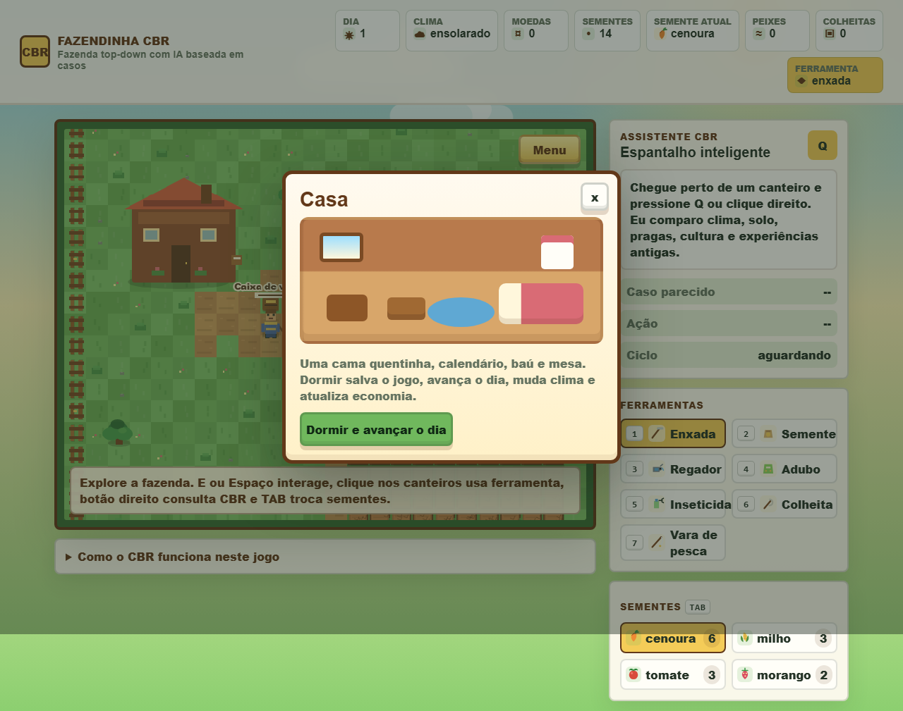
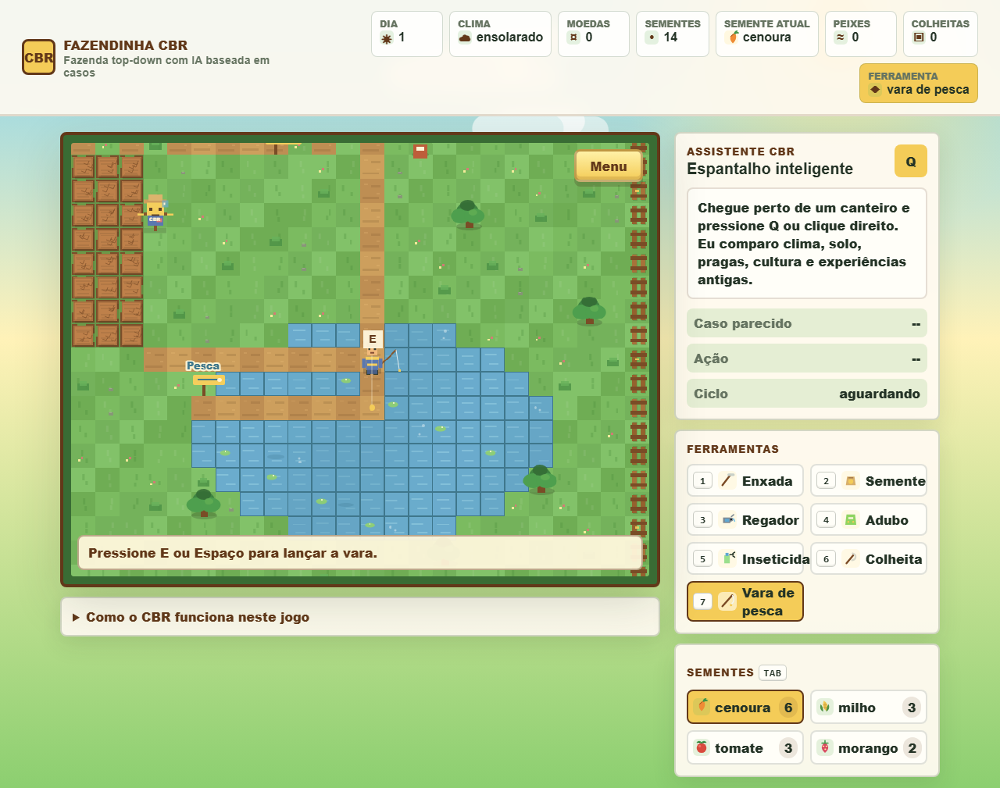
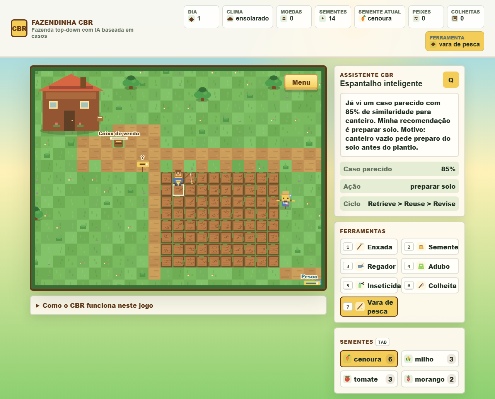

# Fazendinha CBR

Fazendinha CBR é um jogo web 2D top-down de fazenda feito com Vite, TypeScript e Phaser 3. O jogador explora um mapa maior com câmera, cuida dos canteiros, compra sementes, vende colheitas, pesca no lago e recebe recomendações de um assistente agrícola baseado em Raciocínio Baseado em Casos.

O visual usa arte original desenhada por código com Phaser/CSS. A direção é inspirada na sensação de jogos de fazenda e jogos web casuais, mas sem copiar sprites, sons, mapas ou assets protegidos.

## Objetivo Acadêmico

Demonstrar o paradigma de Raciocínio Baseado em Casos, ou CBR, dentro de uma experiência jogável. A IA não é um formulário: ela é um sistema interno do jogo que observa o canteiro, compara com experiências anteriores e sugere uma ação.

Disciplina: Inteligência Artificial  
Tema: Raciocínio Baseado em Casos  
Autores: _preencher com os nomes do grupo_

## Como Acessar Online

O jogo publicado no GitHub Pages ficará disponível em:

https://soturine.github.io/fazenda-inteligente-cbr/

## Capturas Do Jogo

As imagens abaixo mostram a versão atual da interface, com menu de jogo, fazenda jogável, loja, casa, pesca e painel CBR integrado ao gameplay.








## Como Executar Localmente

```bash
npm install
npm run dev
```

Para gerar e testar a versão de produção:

```bash
npm run build
npm run preview
```

## Deploy No GitHub Pages

O projeto usa GitHub Actions para publicar automaticamente no GitHub Pages a partir da branch `main`. O build é gerado com `npm run build`, o Vite cria a pasta `dist/` e o workflow `.github/workflows/deploy.yml` publica esse conteúdo.

O `vite.config.ts` usa:

```ts
base: "/fazenda-inteligente-cbr/"
```

## Controles

- `WASD` ou `setas`: mover o personagem.
- `1` a `7`: trocar ferramenta.
- `TAB`: trocar tipo de semente e equipar automaticamente a ferramenta Semente.
- `E` ou `Espaço`: usar ferramenta ou interagir com casa/loja/lago.
- Clique esquerdo no canteiro: usar a ferramenta atual.
- Clique direito no canteiro: pedir análise CBR daquele canteiro.
- `Q`: consultar o Assistente CBR.
- `N`: dormir/avançar o dia.
- `ESC`: fechar modais ou abrir o menu interno.

## Mecânicas Do Jogo

O jogador começa com sementes iniciais, moedas e uma fazenda com casa, loja, lago, árvores, cercas, espantalho CBR e canteiros. É possível preparar solo, plantar, regar, adubar, tratar pragas, colher, pescar e vender itens.

A casa é a forma principal de dormir e avançar o dia. Dormir salva o jogo, muda o clima, atualiza a economia e faz as plantações crescerem ou piorarem conforme cuidado, solo, umidade e pragas.

## Menu E Customização

Antes de entrar na fazenda, o jogo mostra um menu principal com:

- Jogar;
- Continuar;
- Resetar progresso;
- Como jogar;
- Tela cheia;
- customização do personagem.

A customização salva nome, cor da pele, cor do cabelo, cor da roupa, estilo de cabelo e estilo de roupa. As cores são escolhidas por paletas próprias do jogo, sem depender do seletor nativo do navegador. Há opções curtas, médias, longas, rabo de cavalo, cacheadas, trança, femininas, neutras, boné, chapéu de campo e chapéu de palha. As roupas incluem avental, macacão, camisa, jardineira, casaco, roupa longa, camiseta com alça e roupa de fazenda. Essas escolhas alteram o personagem dentro do jogo e ficam salvas no LocalStorage.

## Menu Interno

O botão "Menu" fica dentro do quadro do jogo, no canto superior direito da área jogável. Ele e a tecla `ESC` abrem um painel interno com dormir, som, salvar, resetar, tela cheia, controles e uma explicação compacta do CBR. A lateral principal fica mais limpa, focada no Assistente CBR, ferramentas e sementes.

## Culturas

O jogo possui quatro culturas:

- cenoura: cresce rápido, vende barato e tolera um pouco de seca;
- milho: cresce mais devagar, vende melhor e gosta de sol;
- tomate: vende bem, mas é mais sensível a pragas;
- morango: prefere clima ameno/chuvoso e vale mais quando pronto.

Cada cultura tem preço de semente, preço base de venda, tempo de crescimento, resistência à seca, resistência a pragas, clima preferido e visual próprio nos estágios de crescimento.

## Loja E Economia Dinâmica

A loja da vila fica no mapa, tem placa visual e NPC vendedor. Ela abre com `E`, `Espaço` ou clique perto da banca. A caixa perto da casa é identificada como caixa de venda e também leva o jogador ao fluxo de venda.

- comprar sementes;
- vender colheitas;
- vender peixes;
- ver preços atuais;
- acompanhar tendência de mercado.

Os preços variam com o dia, clima, cultura, raridade, vendas recentes e eventos simples de mercado. Se o jogador vende muito um item, o preço tende a cair nos próximos dias. Se o clima prejudica uma cultura, seu preço pode subir. O painel mostra tendência com alta, queda ou estabilidade.

## Lago E Pesca

O mapa inclui um lago orgânico com água animada, reflexos, bolhas, lírios, sombras de peixes e movimento. Com a vara de pesca equipada, o jogador pode pescar perto da água.

A pesca tem etapas:

- lançar a linha;
- esperar a boia;
- ver bolhas se aproximando;
- puxar com `E` ou `Espaço` quando a boia tremer;
- capturar o peixe ou perder a fisgada se demorar.

Peixes disponíveis:

- lambari;
- tilápia;
- carpa;
- peixe dourado raro.

O clima influencia a chance de pesca, e os peixes podem ser vendidos na loja por preços variáveis. Todos os peixes são de água doce.

## Clima Visual E Mundo Vivo

O clima aparece no céu, no mapa e nos efeitos:

- ensolarado: céu azul, brilho quente e sol;
- chuvoso: gotas animadas, tom frio e lago mais ativo;
- nublado: nuvens passando e luz suave;
- seco: tom amarelado, poeira e solo secando mais rápido.

Ao dormir, o jogo faz uma transição de noite com lua e paleta mais fria antes de amanhecer. O fundo fora do canvas também muda com clima e noite.

O mapa foi ampliado e usa câmera seguindo o jogador. Árvores maiores balançam com o vento, folhas cruzam a tela, a casa possui detalhes, a cerca tem variações de madeira vertical/horizontal e cantos, há caminhos conectando casa, loja, canteiros, caixa de venda e lago.

## Ferramentas Visíveis

O personagem segura visualmente a ferramenta atual:

- enxada;
- saquinho de sementes;
- regador;
- saco de adubo;
- inseticida/borrifador contra pragas;
- ferramenta de colheita;
- vara de pesca.

As ações têm animações curtas, partículas, sons gerados por Web Audio API e mensagens amigáveis. O botão de som salva a preferência no LocalStorage.

## Como O CBR Aparece No Gameplay

O Assistente CBR é o espantalho inteligente. Ao pressionar `Q` ou clicar com o botão direito em um canteiro, ele monta um caso com:

- clima;
- solo;
- umidade;
- pragas;
- crescimento;
- saúde;
- estágio da planta;
- tipo da cultura.

O sistema recupera o caso mais parecido, reutiliza a ação antiga, revisa a recomendação por regras fortes e aprende quando o jogador avança o dia. O painel compacto mostra similaridade, ação recomendada e ciclo CBR sem dominar a tela.

O assistente também comenta mercado e pesca quando o jogador está perto da loja, caixa de venda ou lago. Ele pode avisar que uma cultura está valorizada, que vender muito derrubou preço, ou que chuva ajuda a pesca.

Uma explicação acadêmica recolhível fica logo abaixo do quadro do jogo, facilitando a apresentação sem poluir a tela principal.

Exemplos de adaptação:

- tomate com pragas médias/altas prioriza tratar pragas;
- solo seco ou umidade baixa prioriza regar;
- solo pobre com planta amarelada prioriza adubar;
- planta pronta prioriza colher;
- solo encharcado evita regar;
- morango valoriza umidade média/alta.
- tomate barato no mercado pode ser melhor vender depois;
- clima chuvoso pode tornar a pesca uma boa alternativa.

## Fórmula De Similaridade

A similaridade é calculada por pontuação, com máximo de 100 pontos:

- clima igual: +10;
- solo igual: +15;
- umidade igual: +15;
- pragas iguais: +15;
- crescimento igual: +10;
- saúde igual: +15;
- estágio da planta igual: +10;
- tipo de cultura igual: +10.

Em caso de empate, o sistema prefere o caso com melhor resultado anterior.

## Estrutura De Arquivos

```text
.
├── index.html
├── css/style.css
├── src/
│   ├── main.ts
│   ├── types.ts
│   ├── scenes/
│   │   ├── BootScene.ts
│   │   ├── MenuScene.ts
│   │   └── FarmScene.ts
│   ├── systems/
│   │   ├── CBRSystem.ts
│   │   ├── CameraSystem.ts
│   │   ├── CharacterCustomizationSystem.ts
│   │   ├── CropSystem.ts
│   │   ├── CropTypeSystem.ts
│   │   ├── DayNightSystem.ts
│   │   ├── EconomySystem.ts
│   │   ├── EffectSystem.ts
│   │   ├── FarmMap.ts
│   │   ├── FishingSystem.ts
│   │   ├── IconSystem.ts
│   │   ├── InventorySystem.ts
│   │   ├── PlayerSystem.ts
│   │   ├── PointerInteractionSystem.ts
│   │   ├── SaveSystem.ts
│   │   ├── ShopSystem.ts
│   │   ├── SoundSystem.ts
│   │   ├── ToolVisualSystem.ts
│   │   ├── VisualStateSystem.ts
│   │   ├── WaterSystem.ts
│   │   ├── WeatherSystem.ts
│   │   └── WeatherVisualSystem.ts
│   ├── entities/
│   │   ├── Assistant.ts
│   │   ├── CropPlot.ts
│   │   └── Player.ts
│   ├── data/
│   │   ├── characterOptions.ts
│   │   ├── cropTypes.ts
│   │   ├── fishTypes.ts
│   │   ├── gameData.ts
│   │   ├── initialCases.ts
│   │   └── shopData.ts
│   └── ui/UISystem.ts
├── docs/
│   ├── screenshots/
│   ├── explicacao-cbr.md
│   └── roteiro-apresentacao.md
├── .github/workflows/deploy.yml
├── vite.config.ts
├── package.json
├── tsconfig.json
├── README.md
├── CHANGELOG.md
└── .gitignore
```

## Persistência

O LocalStorage salva progresso da fazenda, inventário, sementes por cultura, colheitas, peixes, moedas, preços de mercado, casos aprendidos, customização do personagem, ferramenta atual, semente selecionada, posição do jogador e preferência de som.

## Possíveis Melhorias Futuras

- Criar missões semanais e NPCs com diálogos.
- Adicionar upgrades de ferramentas.
- Criar música ambiente autoral.
- Adicionar baú, calendário e caixa de venda mais completa.
- Melhorar a pesca com minigame de precisão.
- Exportar e importar a base de casos aprendidos.
